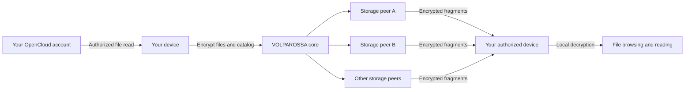

# Project VOLPAROSSA Cloud

**Your files, supported by a cooperative network.**

An OpenCloud integration for Project VOLPAROSSA's **DICN — Decentralized
Intelligent Cooperative Network**. The goal is to keep your files useful and
reachable without requiring your own OpenCloud server to stay switched on.

**Development status:** integration in progress, not a working replacement for
an always-on OpenCloud server. The first component reads explicitly selected
files through authenticated OpenCloud WebDAV. Distributed storage, recovery and
source-off browsing still need to be connected and demonstrated together.

## One core, private files

OpenCloud supplies the familiar file experience; VOLPAROSSA supplies shared
networking, private storage and appropriate compute. Applications reuse the
same compatible core service rather than running independent storage networks.

The planned file path is:



This diagram describes the integration target, not a completed data path.
Peers must not receive readable files, filenames, directory catalogs or recovery
keys. Private storage is separate from the public content cache and training
data. Encryption alone cannot prove what a private file contains.

All applications will follow **one core-owned redundancy policy**, not different
Cloud subscription tiers or per-file copy-count choices. The current core basis
is two copies of each encrypted fragment on distinct providers. Physical remote
usage, including recovery copies and counted overhead, determines the reciprocal
storage contribution. Temporary replacement copies remain charged until the old
copies are confirmed retired. Distinct identities alone do not prove independent
failure domains or continuous availability.

## More than keeping the file bytes

Storing fragments is only one part of keeping OpenCloud usable while its original
server is off. Accounts, directory metadata, permissions, sharing and client
synchronization must remain available too.

The first complete milestone is **private, source-off file browsing**: import
authorized files and their catalog, recover them on an authorized device, and
list/read them through an actual OpenCloud client integration after the original
server is stopped. This will not, by itself, prove complete compatibility with
unmodified web, desktop or mobile clients.

Further integration points include:

- Encrypted selective synchronization, version history and conflict handling.
- Sharing with explicit recipients and revocable permissions, without exposing
  private content to arbitrary storage peers.
- Private search, previews and optional AI assistance on the owner's device or
  another explicitly authorized execution environment.
- Appropriate public-content caching, kept separate from private files.
- Durable notifications and availability information through the common core.

[Architecture, boundaries and remaining work →](docs/ARCHITECTURE.md)

## Development

Node.js 24 or newer is required for the current dependency-free adapter tests:

```sh
node --test test/*.test.mjs
```

Tests use synthetic loopback WebDAV fixtures. They do not install OpenCloud,
contact an account, enable network participation or alter host network settings.
They are adapter checks, not proof of an end-to-end OpenCloud/VOLPAROSSA service.

## Upstream and licensing

The integration targets the production OpenCloud server **v7.2.4**, pinned to
`1770793f2657e153836c32d32dd6d256b8531d3d`. New original integration code is
**GPL-3.0-only**. OpenCloud server uses **Apache-2.0**; its separate web client uses
**AGPL-3.0**. Those component licenses remain distinct.

[Source provenance →](THIRD_PARTY_LICENSES.md)
