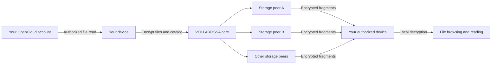

# Project VOLPAROSSA Cloud

**Your files, supported by a cooperative network.**

An OpenCloud integration for Project VOLPAROSSA's **DICN — Decentralized
Intelligent Cooperative Network**. The goal is to keep your files useful and
reachable without requiring your own OpenCloud server to stay switched on.

**Development status:** integration in progress, not a working replacement for
an always-on OpenCloud server. Authorized file import, encryption and repeated
restoration now pass a real protected-peer trial with the original synthetic
DAV source stopped and one storage provider offline. A new encrypted catalog
and authenticated, read-only DAV service make selected files browsable through
the OpenCloud Web SDK. That SDK-to-peer read path now also passes its own live
trial: listing, full/range reads, authentication checks and private cleanup with
the source and one provider offline. A source-built **OpenCloud Files interface**
now has an explicit owner-local, read-only recovery mode. Its joined browser/peer
trial also passes: original Files navigation and two verified downloads with the
source and one provider offline. This is not a replacement account service,
writable synchronization or second-device recovery.

## One core, private files

OpenCloud supplies the familiar file experience; VOLPAROSSA supplies shared
networking, private storage and appropriate compute. Applications reuse the
same compatible core service rather than running independent storage networks.

The planned file path is:



This diagram describes the integration target, not a completed data path.
Peers must not receive readable files, filenames, directory catalogs or recovery
keys. Private storage is separate from the public content cache and training
data. Encryption alone cannot prove what a private file contains.

All applications will follow **one core-owned redundancy policy**, not different
Cloud subscription tiers or per-file copy-count choices. The current core basis
is two copies of each encrypted fragment on distinct providers. Physical remote
usage, including recovery copies and counted overhead, determines the reciprocal
storage contribution. Temporary replacement copies remain charged until the old
copies are confirmed retired. Distinct identities alone do not prove independent
failure domains or continuous availability.

## More than keeping the file bytes

Storing fragments is only one part of keeping OpenCloud usable while its original
server is off. Accounts, directory metadata, permissions, sharing and client
synchronization must remain available too.

The first demonstrated application milestone is **private, source-off file browsing**:
import explicitly selected files and their catalog, then recover and read them
through the original Files interface after the synthetic source is stopped.
This uses an owner-local recovery adapter, not ordinary OpenCloud account login;
it does not prove complete compatibility with unmodified web, desktop or mobile clients.

Further integration points include:

- Encrypted selective synchronization, version history and conflict handling.
- Sharing with explicit recipients and revocable permissions, without exposing
  private content to arbitrary storage peers.
- Private search, previews and optional AI assistance on the owner's device or
  another explicitly authorized execution environment.
- Appropriate public-content caching, kept separate from private files.
- Durable notifications and availability information through the common core.

[Architecture, boundaries and remaining work →](docs/ARCHITECTURE.md)

## First executable slice: private file recovery

The new `scripts/cloud-file.mjs` command separates authorized import, storage
placement and recovery. Only the encrypted file goes to storage peers; the
per-file recovery key stays with its owner. Restoring never consumes the stored
copy, contacts the DAV source as a fallback or overwrites an existing output.

```text
import        Authenticated DAV → owner-private encrypted file and receipt
create        Encrypted file → core-owned fragment plan and owner journal
deposit       Encrypted fragments → authorized storage providers
restore       Storage providers → verified ciphertext → private owner output
restore-local Explicit recovery from a locally retained encrypted file
```

This command supplies **file recovery**, not an OpenCloud account or
synchronization service. Names and source versions are encrypted inside each
object. Imports temporarily use private plaintext staging on the owner's
device; storage peers never receive that staging data.

[Commands, configuration and recovery boundaries →](docs/PRIVATE_FILES.md)

## Source-off browsing: an encrypted catalog and local read service

`cloud-catalog.mjs` records an explicit owner selection after restoring and
verifying each file. `cloud-serve.mjs` exposes that immutable private catalog
through authenticated listing, file reads and ranges on loopback. File reads
restore from the shared core, verify and decrypt locally, then remove their
temporary plaintext; the original server is never a fallback.

The actual pinned OpenCloud Web SDK can exercise the DAV interface. The original
OpenCloud Files application can also be built with a narrow recovery adapter:
open the local service, enter its private access token and browse the explicitly
selected files. It retains the original Files navigation and download controls,
not an imitation file browser. This local recovery authority is visibly separate
from an OpenCloud account; it grants no upstream identity, write or sharing rights.

The catalog and per-file recovery keys/journals currently remain on the owner's
device; second-device recovery remains work in progress.

[Run the private read service and see its evidence boundaries →](docs/OFFLINE_READ.md)

[Build and open the original Files recovery interface →](docs/RECOVERY_WEB.md)

## Development

The dependency-free JavaScript runs on Node.js 24 or newer. Private-file tests
also use the installed Linux Python 3.11+ and GnuPG tools (`gpg`, `gpg-agent`,
`gpgconf`); nothing is downloaded or installed automatically:

```sh
node --test test/*.test.mjs
```

Local tests use synthetic loopback WebDAV fixtures and real local GnuPG. They do
not install OpenCloud, contact an account, enable network participation or alter
host network settings. The optional actual SDK check requires explicit pinned
staging. Injected storage fixtures are labelled and are not peer-placement proof.

The separate [protected-peer trial](https://github.com/VOLPAROSSA/volparossa/actions/runs/36909989038)
passed for Cloud `541cc826fe14ce69cf89a82ecb600ad14dd534c6` and core
`41e404a40312f039827f761dea7b90be48d0c21f`: authenticated synthetic source import,
eight encrypted fragment copies on three providers, source and local ciphertext
removed, provider A offline, two hash-verified recoveries from B/C, complete
retirement/accounting and unchanged host networking. That trial predates the
catalog/read-service additions and does not prove the full OpenCloud UI.

The subsequent [SDK-to-peer trial](https://github.com/VOLPAROSSA/volparossa/actions/runs/36916040042)
passes for Cloud `a67b91fbed42ecd23ba215eb21ef54397fc9f06a` and core
`5d9d347fc52e4cc13498ed3b6790d1f00de370c3`. Four B/C reconstructions include
catalog creation and actual SDK reads while source/local ciphertext/provider A
are unavailable. All 32 required protected MPTCP/TLS exchanges, retained charges,
all-copy deletion and unchanged host state pass. Exact-source replay of the
44 original artifacts also passes. Range reads currently restore the whole
encrypted file before returning the requested bytes.

The subsequent [original Files UI/peer trial](https://github.com/VOLPAROSSA/volparossa/actions/runs/36940326270)
passes for Cloud `63bba5d1163a69e1ee6b4218c9e7462d941f22f7` and core
`d7403106837962c66cd0af0e049236785d8053cb`. With the source stopped, local ciphertext
removed and provider A offline, six protected reconstructions from B/C serve the
direct restore, catalog, SDK reads and two independently verified original UI
downloads. Authentication denial, logout, non-consuming reads, all-copy retirement
and unchanged host state pass. The earlier failed UI trials remain recorded in
[the recovery-interface evidence](docs/RECOVERY_WEB.md); accounts, writes, sharing,
cross-device recovery and synchronization remain open.

## Upstream and licensing

The integration targets the production OpenCloud server **v7.2.4**, pinned to
`1770793f2657e153836c32d32dd6d256b8531d3d`. New original integration code is
**GPL-3.0-only**. OpenCloud server uses **Apache-2.0**; its separate web client uses
**AGPL-3.0**. Those component licenses remain distinct.

[Source provenance →](THIRD_PARTY_LICENSES.md)
